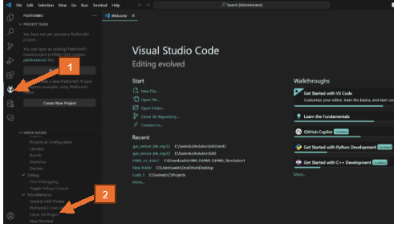
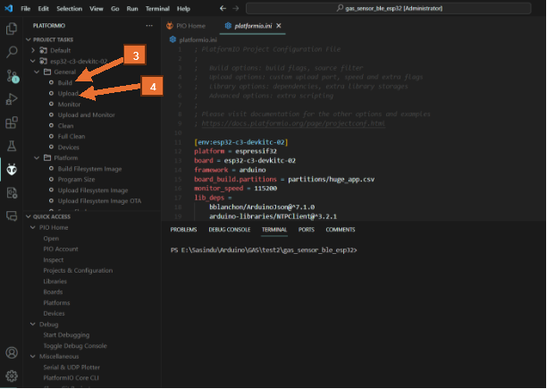

**Steps for uploading the firmware to the Gateway.**

Step 1:

Install platformIO extension in VS code. (<https://www.youtube.com/watch?v=5edPOlQQKmo>)

Step 2:

Open VS Code, and go to platformIO in the leftmost tab. Then click on “Clone Git Project” under Miscellaneous section.

Step 3:

Type in the GitHub clone link and wait for the cloning to happen.

Step 4:

After the cloning process is completed, it will show the Project Tasks menu in the PlatformIO tab.

Now connect the ESP board via USB and click on Build.

After Build is completed, click on Upload. (or Upload and Monitor).

